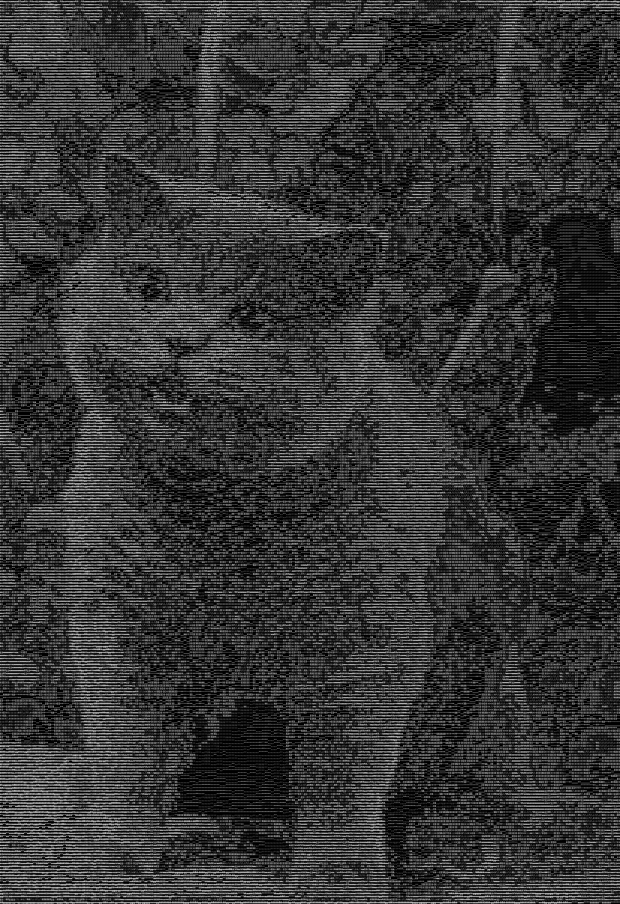

<div id="top"></div>

<!-- PROJECT SHIELDS -->
<!--
*** I'm using markdown "reference style" links for readability.
*** Reference links are enclosed in brackets [ ] instead of parentheses ( ).
*** See the bottom of this document for the declaration of the reference variables
*** for contributors-url, forks-url, etc. This is an optional, concise syntax you may use.
*** https://www.markdownguide.org/basic-syntax/#reference-style-links
-->
[![Contributors][contributors-shield]][contributors-url]
[![Forks][forks-shield]][forks-url]
[![Stargazers][stars-shield]][stars-url]
[![Issues][issues-shield]][issues-url]
[![WTFPL License][license-shield]][license-url]


<!-- PROJECT LOGO -->
<br />
  <h3 align="center">ASCII-Art-Generator</h3>

  <p align="center">
    Convert an Image into an ASCII art!
    <br />
    <a href="https://github.com/LordRonz/ASCII-Art-Generator"><strong>Explore the docs »</strong></a>
    <br />
    <br />
    <a href="https://github.com/LordRonz/ASCII-Art-Generator">View Demo</a>
    ·
    <a href="https://github.com/LordRonz/ASCII-Art-Generator/issues">Report Bug</a>
    ·
    <a href="https://github.com/LordRonz/ASCII-Art-Generator/issues">Request Feature</a>
  </p>
</div>


<!-- TABLE OF CONTENTS -->
<details>
  <summary>Table of Contents</summary>
  <ol>
    <li>
      <a href="#about-the-project">About The Project</a>
      <ul>
        <li><a href="#built-with">Built With</a></li>
      </ul>
    </li>
    <li>
      <a href="#getting-started">Getting Started</a>
      <ul>
        <li><a href="#prerequisites">Prerequisites</a></li>
        <li><a href="#installation">Installation</a></li>
      </ul>
    </li>
    <li><a href="#usage">Usage</a></li>
    <li><a href="#roadmap">Roadmap</a></li>
    <li><a href="#contributing">Contributing</a></li>
    <li><a href="#license">License</a></li>
    <li><a href="#acknowledgments">Acknowledgments</a></li>
  </ol>
</details>


<!-- ABOUT THE PROJECT -->
## About The Project

Idk man i'm just bored

<p align="right">(<a href="#top">back to top</a>)</p>


### Built With

* [Pillow](https://python-pillow.org/)
* [NumPy](https://numpy.org/)

<p align="right">(<a href="#top">back to top</a>)</p>


<!-- GETTING STARTED -->
## Getting Started

To get a local copy up and running follow these simple example steps.

### Prerequisites

These are things that you'll need to use this program
* Python
* Packages (Pillow and Numpy)
```sh
pip install -r requirements.txt
```

### Installation

1. Clone the repo
   ```sh
   git clone https://github.com/LordRonz/ASCII-Art-Generator.git
   ```
2. Install required packages
   ```sh
   pip install -r requirements.txt
   ```

<p align="right">(<a href="#top">back to top</a>)</p>


<!-- USAGE EXAMPLES -->
## Usage

Do this to show the help message

```sh
python main.py -h
```

Actual usage

```sh
python main.py shrek.png
```

You can name the output file too

```sh
python main.py shrek.png -o shrex.png
```

Enable color
```sh
python main.py shrek.png -c
```

### Example

> Input Image


> Output Image



> Colored Output


<p align="right">(<a href="#top">back to top</a>)</p>

<!-- ROADMAP -->
## Roadmap

- [x] Printing the ASCII into the stdout
- [x] Outputing an actual Image
- [x] Add support for arguments
- [ ] Add some coloring options

See the [open issues](https://github.com/LordRonz/ASCII-Art-Generator/issues) for a full list of proposed features (and known issues).

<p align="right">(<a href="#top">back to top</a>)</p>


<!-- CONTRIBUTING -->
## Contributing

Contributions are what make the open source community such an amazing place to learn, inspire, and create. Any contributions you make are **greatly appreciated**.

If you have a suggestion that would make this better, please fork the repo and create a pull request. You can also simply open an issue with the tag "enhancement".
Don't forget to give the project a star! Thanks again!

1. Fork the Project
2. Create your Feature Branch (`git checkout -b feature/AmazingFeature`)
3. Commit your Changes (`git commit -m 'Add some AmazingFeature'`)
4. Push to the Branch (`git push origin feature/AmazingFeature`)
5. Open a Pull Request

<p align="right">(<a href="#top">back to top</a>)</p>


<!-- LICENSE -->
## License

Distributed under the [WTFPL](http://www.wtfpl.net/) License. See `LICENSE` for more information.

<p align="right">(<a href="#top">back to top</a>)</p>

<!-- ACKNOWLEDGMENTS -->
## Acknowledgments

Use this space to list resources you find helpful and would like to give credit to. I've included a few of my favorites to kick things off!

* [Programming Projects for Advanced Beginners #1: ASCII art](https://robertheaton.com/2018/06/12/programming-projects-for-advanced-beginners-ascii-art/)
* [Best-README-Template](https://github.com/othneildrew/Best-README-Template)

<p align="right">(<a href="#top">back to top</a>)</p>


<!-- MARKDOWN LINKS & IMAGES -->
<!-- https://www.markdownguide.org/basic-syntax/#reference-style-links -->
[contributors-shield]: https://img.shields.io/github/contributors/LordRonz/ASCII-Art-Generator.svg?style=for-the-badge
[contributors-url]: https://github.com/LordRonz/ASCII-Art-Generator/graphs/contributors
[forks-shield]: https://img.shields.io/github/forks/LordRonz/ASCII-Art-Generator.svg?style=for-the-badge
[forks-url]: https://github.com/LordRonz/ASCII-Art-Generator/network/members
[stars-shield]: https://img.shields.io/github/stars/LordRonz/ASCII-Art-Generator.svg?style=for-the-badge
[stars-url]: https://github.com/LordRonz/ASCII-Art-Generator/stargazers
[issues-shield]: https://img.shields.io/github/issues/LordRonz/ASCII-Art-Generator.svg?style=for-the-badge
[issues-url]: https://github.com/LordRonz/ASCII-Art-Generator/issues
[license-shield]: https://img.shields.io/github/license/LordRonz/ASCII-Art-Generator.svg?style=for-the-badge
[license-url]: https://github.com/LordRonz/ASCII-Art-Generator/blob/master/LICENSE
[product-screenshot]: images/screenshot.png
